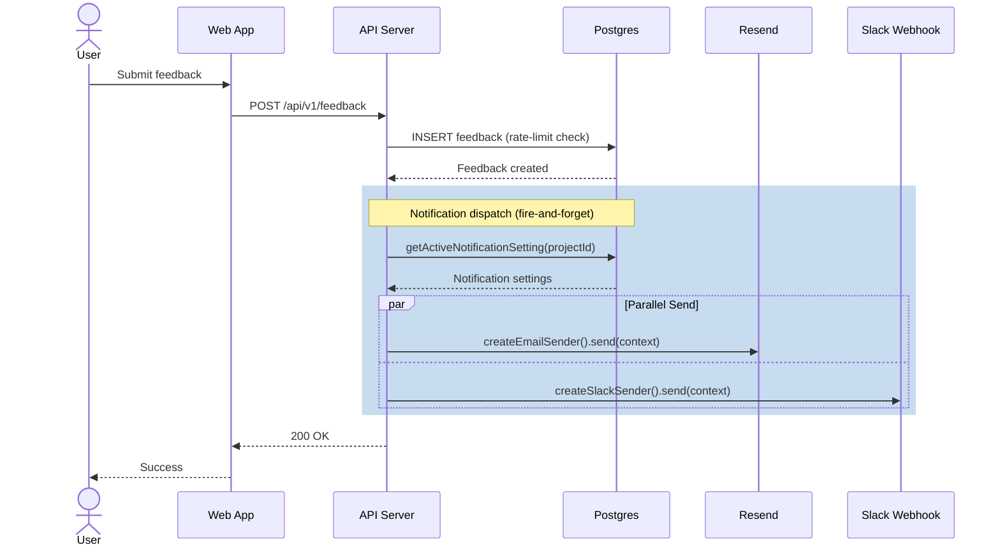
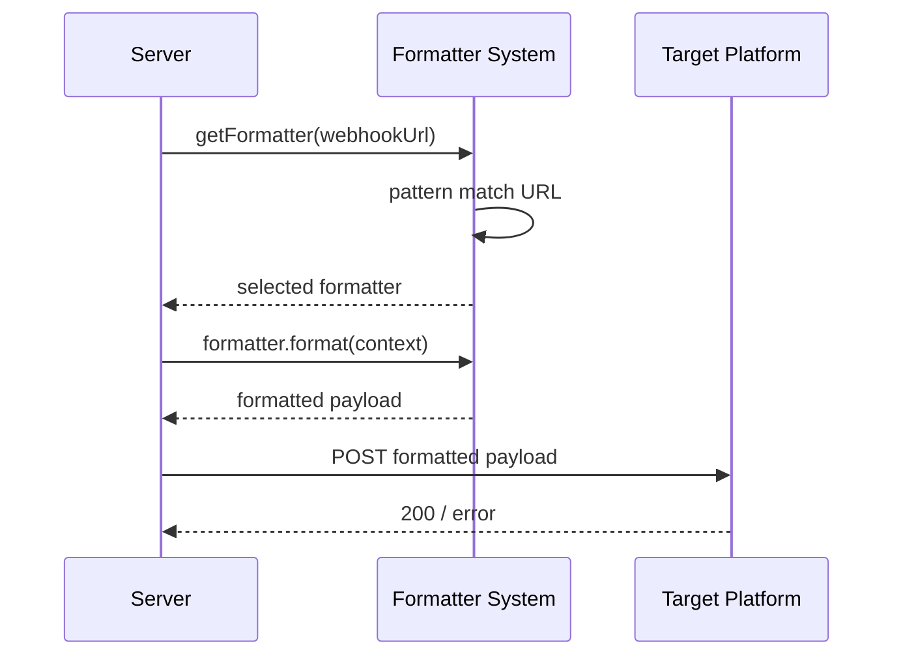

# PR #51 CodeRabbit AI 리뷰 분석

> **PR 제목**: chore: develop → main 릴리즈
> **리뷰 일시**: 2026-01-07
> **리뷰어**: CodeRabbit AI

## 요약

이 PR은 다음과 같은 주요 변경사항을 포함합니다:
- Prisma에서 pg + raw SQL로 데이터 레이어 마이그레이션
- AppError와 zodValidator를 통한 통합 에러/검증 처리
- 멀티 채널 프로젝트 알림 시스템 (이메일 via Resend, Slack webhooks)
- 인증 라우트 `/(auth)` 그룹 재구성
- 웹훅 포매터 전략 패턴 (Slack, Discord, Telegram, generic)

---

## 코드 리뷰 코멘트

### 1. 접근성 이슈 - Label과 Textarea 연결 (✅ 해결됨)

**파일**: `apps/web/src/components/projects/notification-settings/email-section.tsx`
**심각도**: ⚠️ Potential issue | Minor
**상태**: ✅ 커밋 `d0fcf3d`에서 해결됨

**문제점**:
label이 textarea와 연결되지 않아 스크린 리더 사용자의 접근성에 영향을 줌.

**수정 방법**:
```tsx
<label
  className="block text-sm font-medium text-gray-700 mb-1"
  htmlFor="email-recipients"
>
  수신자 이메일 (최대 10명)
</label>
<textarea
  id="email-recipients"
  value={recipients}
  ...
/>
```

---

### 2. React Key로 Index 대신 Content 사용 권장

**파일**: `apps/web/src/components/projects/notification-settings/email-section.tsx`
**심각도**: 🧹 Nitpick | Trivial
**상태**: 🔄 미해결 (선택사항)

**문제점**:
배열 index를 `key` prop으로 사용하면 리스트 순서 변경이나 항목 수정 시 문제가 발생할 수 있음.
이메일 주소는 고유해야 하므로 trimmed line content를 key로 사용 권장.

**현재 코드** (lines 57-74):
```tsx
{lines.map((line, i) => {
  const isValid = !errors.includes(line.trim());
  return (
    <div key={i} ...>
```

**제안된 수정**:
```tsx
{lines.map((line) => {
  const isValid = !errors.includes(line.trim());
  return (
    <div key={line.trim()} ...>
```

**참고**: 중복 항목이 있을 수 있다면 `${line.trim()}-${i}` 형태의 복합 key 사용 고려.

---

### 3. NotificationSettings 컴포넌트 SRP 위반 (🛠️ 리팩토링 권장)

**파일**: `apps/web/src/components/projects/notification-settings/index.tsx`
**심각도**: 🛠️ Refactor suggestion | Major
**상태**: 🔄 미해결

**문제점**:
- 컴포넌트가 185줄로 코딩 가이드라인(함수 ≤20줄) 초과
- 여러 책임을 한 컴포넌트에서 처리:
  - 데이터 fetching 및 상태 관리
  - 이메일 검증 로직
  - Slack URL 검증 로직
  - 폼 제출 처리
  - UI 렌더링

**제안된 리팩토링**:
```
1. useNotificationSettings(projectId) - 데이터 로딩 및 상태 관리 커스텀 훅
2. useEmailValidation() - 이메일 검증 로직 커스텀 훅
3. useSlackValidation() - Slack URL 검증 커스텀 훅
4. Presentational component - props만 받는 프레젠테이셔널 컴포넌트 분리
```

**기대 효과**:
- 테스트 용이성 향상
- 재사용성 증가
- SOLID 원칙 준수

---

### 4. Button Type 명시 필요

**파일**: `apps/web/src/components/projects/notification-settings/index.tsx`
**심각도**: ⚠️ Biome lint error
**상태**: 🔄 미해결

**문제점** (lines 187-193):
버튼의 기본 type은 `submit`으로, form 내에 배치되면 의도치 않게 폼이 제출될 수 있음.

**수정 방법**:
```tsx
<button
  type="button"  // 명시적으로 type 추가
  onClick={handleSave}
  disabled={saving || emailErrors.length > 0 || !!slackError}
  ...
>
```

---

## Pre-merge 체크 결과

| 체크 | 상태 | 설명 |
|------|------|------|
| Description Check | ✅ 통과 | - |
| Title Check | ✅ 통과 | PR 제목이 변경 범위와 일치 |
| Docstring Coverage | ⚠️ 경고 | 40.63% (요구: 80%) |

---

## 시퀀스 다이어그램

### 피드백 제출 및 알림 발송 흐름



### 웹훅 포매터 흐름



---

## 권장 조치 사항

### 즉시 수정 권장
1. **Button type 추가** - form 내 의도치 않은 제출 방지

### 추후 개선 권장
1. **NotificationSettings 리팩토링** - 커스텀 훅으로 로직 분리
2. **React key 개선** - index 대신 고유값 사용
3. **Docstring 추가** - 커버리지 80% 달성

---

## 관련 PR

- **#45**: 인증 라우트 그룹핑 (login/signup/onboarding/verify-email → `/(auth)`)
- **#47**: Prisma→pg 마이그레이션, webhook formatters, AppError/zodValidator
- **#44**: admin 라우트 및 routeTree 수정

---

## 결론

CodeRabbit AI 리뷰 결과, **접근성 이슈 1건이 이미 해결**되었고, 나머지는 대부분 코드 품질 개선을 위한 **nitpick** 또는 **리팩토링 제안**입니다.

머지에 blocking되는 심각한 이슈는 없으며, 권장 조치 사항은 추후 별도 PR로 진행해도 무방합니다.
